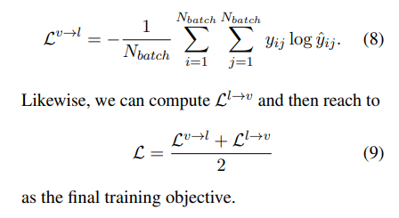
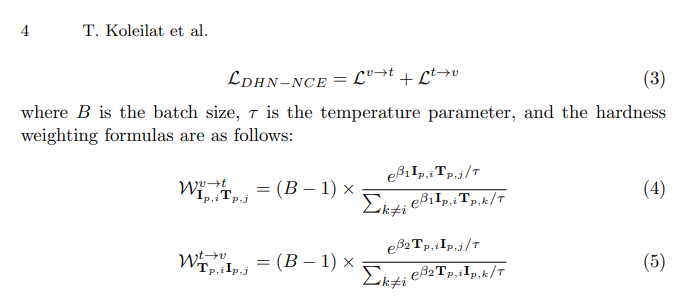
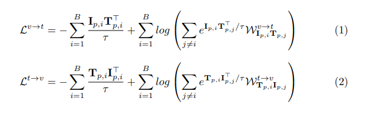

# Similarity: Applying MedCLIP Architecture

## 1. Introduction
- This project aims to use [MedCLIP's](https://arxiv.org/pdf/2210.10163) architecture to primarily address the issues of data scarcity and false negatives (possibly because of unclean data)
- MedCLIP solves the problem of a lack of paired data by decoupling the data points, allowing the training set to increase to O(n^2)
- This project also aims to enhance Explainable AI (XAI) by implementing [MedCLIP-SAM](https://arxiv.org/pdf/2403.20253): Another architecture which uses saliency matching to highlight regions of interest
- **Note**: CLIP architectures consist of a vision encoder and a text encoder. The objective is to generate embeddings for each of these such that matching and similar inputs are embedded close together.

## 2. MedCLIP
- In the medical field, due to privacy, admin and financial constraints, publicly available chest scans and their corresponding medical reports (and vice versa) are rare to come by.
- Using the existing data uses a patient id as a ground truth. But if 2 patients have similar chest scans and reports, their scans will be trained to output dissimilar embeddings when they should be similar.
- MedCLIP is a pre-training framework that decouples and then recouples the data using existing architecture (in this case MetaMap) to generate a ground truth.
- It uses **Semantic Matching Loss** to fine tune existing models
- They fine tune the BioClinicalBERT text encoder and the ImageNET image encoder. 

### MedCLIP approach
1. Decouple data so we have a set of images and a set of text
2. Generate simple embeddings for each one using existing, lightweight architectures.
3. Dot product each embedding with each other one to generate similarity matrix
5. Use Semantic Matching Loss on similarity matrix after applying softmax both row-wise and column-wise.

## 3. MedCLIP-SAM
- The MedCLIP-SAM paper explores 3 points:
1. A new CLIP training architecture using a **Decoupled Hard Negative Noise Contrastive Estimation** (DHN-NCE) Loss Function

- Interestingly, MedCLIP-SAM uses a different architecture to MedCLIP
- They pre-train BiomedCLIP by Microsoft
- This is trained on a much larger dataset and has a vast general knowledge to help with Zero-Shot-Segmentation

2. Build an architecture for **Zero Shot Segmentation**: Highlight relevant pixels or region of image
    - Uses BiomedCLIP report/image retrieval with SAM (Segment Anything Model)
    - SAM performs actual segmentation
3. They explored a weakly supervised method of improving Zero Shot Segmentation
