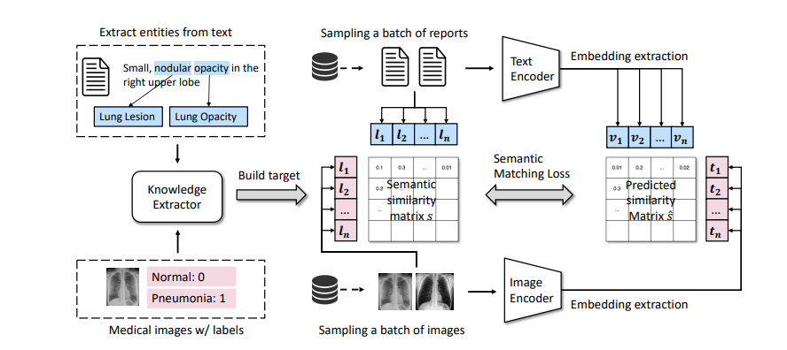

# Similarity: Applying MedCLIP Architecture

## 1. Introduction
- This project aims to use [MedCLIP's](https://arxiv.org/pdf/2210.10163) architecture to primarily address the issues of data scarcity and false negatives (possibly because of unclean data)
- MedCLIP solves the problem of a lack of paired data by decoupling the data points, allowing the training set to increase to O(n^2)
- This project aims to *explore the further applications of MedCLIP to general use cases, and build on its architecture further*

## 2. Motivation and Problem Statement
- In the medical field, due to privacy, admin and financial constraints, publicly available chest scans and their corresponding medical reports (and vice versa) are rare to come by.
- Using the existing data uses a patient id as a ground truth. But if 2 patients have similar chest scans and reports, their scans will be trained to output dissimilar embeddings when they should be similar.
- MedCLIP decouples the data so it no longer uses the patient id as a ground truth. It generates embeddings using lightweight tools and uses their cosine similarity as a ground truth - which takes the original patient id out of the equation.

## 3. Architecture

## 4. Datasets

## 5. Progress

## 6. Next Steps